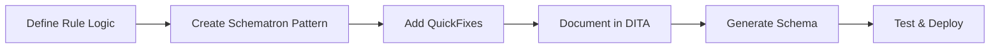

## Overview

Beyond using DIM's built-in patterns, you can create completely custom validation rules tailored to your organization's specific style guide requirements. This guide covers the full lifecycle of custom rule development.

## Rule Development Workflow



## Creating Custom Schematron Patterns

### Basic Rule Structure

Create a new abstract pattern in your `library.sch`:

```xml
<pattern abstract="true" id="checkImageAlt">
  <title>Ensure all images have alt text</title>
  <p>This pattern validates that image elements contain meaningful 
     alternative text for accessibility.</p>
  <parameters xmlns="http://oxygenxml.com/ns/schematron/params">
    <parameter>
      <name>imageElement</name>
      <desc>The image element to validate (e.g., image, fig)</desc>
    </parameter>
    <parameter>
      <name>minLength</name>
      <desc>Minimum character length for alt text</desc>
    </parameter>
    <parameter>
      <name>message</name>
      <desc>Validation message to display</desc>
    </parameter>
  </parameters>
  <rule context="$imageElement">
    <assert test="alt and string-length(alt) &gt;= $minLength" role="warn">
      $message
      Current length: <value-of select="string-length(alt)"/>
    </assert>
  </rule>
</pattern>
```

### Advanced XPath Techniques

#### Using Predicates for Complex Validation

```xml
<pattern abstract="true" id="checkCodeBlockLanguage">
  <title>Require language specification in code blocks</title>
  <parameters xmlns="http://oxygenxml.com/ns/schematron/params">
    <parameter>
      <name>codeElement</name>
      <desc>The code element (e.g., codeblock)</desc>
    </parameter>
  </parameters>
  <rule context="$codeElement[string-length(normalize-space(.)) &gt; 50]">
    <!-- Only check code blocks longer than 50 characters -->
    <assert test="@outputclass and @outputclass != 'language-text'" 
      role="warn" sqf:fix="addLanguageClass">
      Long code blocks should specify a programming language.
    </assert>
  </rule>
</pattern>
```

#### Cross-Reference Validation

```xml
<pattern abstract="true" id="validateXref">
  <title>Validate cross-references</title>
  <rule context="xref[@href]">
    <let name="target" value="substring-before(@href, '#')"/>
    <let name="hasTarget" value="doc-available(resolve-uri($target, base-uri(.)))"/>
    <assert test="$hasTarget or starts-with(@href, '#')" role="error">
      Cross-reference target not found: <value-of select="@href"/>
    </assert>
  </rule>
</pattern>
```

<Expandable title="Understanding doc-available()">

The `doc-available()` function is an XSLT 2.0 function that checks if a document exists without throwing an error if it doesn't. This is perfect for validating cross-references.

**Note**: This works because DIM uses `queryBinding="xslt2"` (see `library.sch:3`).

</Expandable>

### Contextual Validation

#### Parent-Child Relationships

```xml
<pattern abstract="true" id="requireDescInTaskStep">
  <title>Require description in task steps with substeps</title>
  <rule context="step[steps]">
    <assert test="cmd" role="error">
      Parent steps with substeps must have a command element.
    </assert>
    <assert test="following-sibling::*[1][self::info or self::stepxmp]" role="warn">
      Consider adding info or example after complex nested steps.
    </assert>
  </rule>
</pattern>
```

#### Sibling Validation

```xml
<pattern abstract="true" id="avoidConsecutiveSameElements">
  <title>Warn about consecutive identical elements</title>
  <parameters xmlns="http://oxygenxml.com/ns/schematron/params">
    <parameter>
      <name>element</name>
      <desc>Element to check for duplication</desc>
    </parameter>
    <parameter>
      <name>message</name>
      <desc>Warning message</desc>
    </parameter>
  </parameters>
  <rule context="$element[following-sibling::*[1][name() = name(current())]]">
    <report test="normalize-space(.) = normalize-space(following-sibling::*[1])" 
      role="warn" sqf:fix="mergeConsecutive deleteSecond">
      $message
    </report>
  </rule>
</pattern>
```

## Creating QuickFixes

QuickFixes provide automated corrections for validation issues. They're defined in `quickFix-library.xml`.

### QuickFix Anatomy

```xml
<sqf:fix id="fixId">
  <sqf:description>
    <sqf:title>Human-readable fix description</sqf:title>
  </sqf:description>
  <!-- Fix operations -->
</sqf:fix>
```

### Common QuickFix Operations

#### Delete Operation

Simple deletion (see `quickFix-library.xml:111-116`):

```xml
<sqf:fix id="removeCurrentElement">
  <sqf:description>
    <sqf:title>Remove invalid element '<value-of select="local-name()"/>'</sqf:title>
  </sqf:description>
  <sqf:delete/>
</sqf:fix>
```

Delete specific attribute (`quickFix-library.xml:5-11`):

```xml
<sqf:fix id="avoidAttributeInElement_delete">
  <sqf:param name="attribute" abstract="true"/>
  <sqf:description>
    <sqf:title>The attribute "<value-of select="'$attribute'"/>" will be deleted.</sqf:title>
  </sqf:description>
  <sqf:delete match="@$attribute"/>
</sqf:fix>
```

#### Add Operation

Add new element (`quickFix-library.xml:76-82`):

```xml
<sqf:fix id="recommendElementInParent_createFirstChild">
  <sqf:param name="element" abstract="true"/>
  <sqf:description>
    <sqf:title>The element "<value-of select="'$element'"/>" will be created as first child.</sqf:title>
  </sqf:description>
  <sqf:add target="$element" node-type="element" position="first-child"/>
</sqf:fix>
```

Position options:
- `first-child` - Inside, before existing children
- `last-child` - Inside, after existing children
- `before` - Before the current element
- `after` - After the current element

#### Replace Operation

Replace with user input (`quickFix-library.xml:97-110`):

```xml
<sqf:fix id="restrictWords_setNew">
  <sqf:param name="parentElement" abstract="true"/>
  <sqf:description>
    <sqf:title>The content of the element "<value-of select="'$parentElement'"/>" 
               will be set by a user entry.</sqf:title>
  </sqf:description>
  <sqf:user-entry name="new-content">
    <sqf:description>
      <sqf:title>Please enter the new content of the element 
                 "<value-of select="'$parentElement'"/>".</sqf:title>
    </sqf:description>
  </sqf:user-entry>
  <sqf:replace target="$parentElement" node-type="element">
    <value-of select="$new-content"/>
  </sqf:replace>
</sqf:fix>
```

#### String Replace Operation

Regex-based text replacement (`quickFix-library.xml:24-35`):

```xml
<sqf:fix id="avoidWordInElement_deleteWord">
  <sqf:param name="word" abstract="true"/>
  <sqf:description>
    <sqf:title>"<value-of select="'$word'"/>" will be deleted.</sqf:title>
  </sqf:description>
  <let name="quoted" value="'$word'"/>
  <sqf:stringReplace match=".//text()" regex="(?i)(\s|^)({$quoted})(\s|$)">
    <xsl:value-of select="if (lower-case(.)=lower-case($quoted) or 
        ends-with(lower-case(.), lower-case($quoted)) or 
        starts-with(lower-case(.), lower-case($quoted))) then '' else ' '"/>
  </sqf:stringReplace>
</sqf:fix>
```

### Advanced QuickFix Techniques

#### Conditional Fixes with use-when

Only show fix when applicable (`quickFix-library.xml:24`):

```xml
<sqf:fix id="avoidWordInElement_deleteWord" 
  use-when=".//text()[matches(., '(\s|^)($word)(\s|$)', 'i')]" 
  role="delete">
```

The `use-when` attribute prevents the fix from appearing when it wouldn't work.

#### Multiple User Inputs

```xml
<sqf:fix id="addStructuredContent">
  <sqf:description>
    <sqf:title>Add structured content with title and description</sqf:title>
  </sqf:description>
  
  <sqf:user-entry name="title">
    <sqf:description>
      <sqf:title>Enter the title</sqf:title>
    </sqf:description>
  </sqf:user-entry>
  
  <sqf:user-entry name="description">
    <sqf:description>
      <sqf:title>Enter the description</sqf:title>
    </sqf:description>
  </sqf:user-entry>
  
  <sqf:add position="after">
    <section>
      <title><value-of select="$title"/></title>
      <p><value-of select="$description"/></p>
    </section>
  </sqf:add>
</sqf:fix>
```

#### Fix with Calculated Content

```xml
<sqf:fix id="normalizeWhitespace">
  <sqf:description>
    <sqf:title>Normalize whitespace</sqf:title>
  </sqf:description>
  <let name="normalized" value="normalize-space(.)"/>
  <sqf:replace>
    <value-of select="$normalized"/>
  </sqf:replace>
</sqf:fix>
```

## Extending the Business Rule Library

DIM uses a Java-based business rule system for integration with oXygen. Understanding this system allows you to create rules that appear in the UI.

### Business Rule Structure

Rules are represented by the `BusinessRule` class (`BusinessRule.java:16`):

```java
public class BusinessRule {
  private String ruleName;              // Pattern ID
  private List<BusinessRuleParam> params;  // Parameters
  private String description;           // Documentation
}
```

### Parameter Definition

Parameters use `BusinessRuleParam` with name and description:

```java
public class BusinessRuleParam {
  private String name;    // Parameter name
  private String desc;    // Parameter description
}
```

### Library Loading

The `BusinessRuleRepository` loads rules from the Schematron library using XSLT extraction.

**Key process** (`AddBusinessRuleOperation.java:143-145`):

```java
BusinessRuleLibrary rulesLibrary = BusinessRuleRepository.getInstance().loadLibrary(
    authorAccess.getXMLUtilAccess(), 
    library);
```

This parses `library.sch`, extracting all abstract patterns and their parameter definitions.

### Rule Instantiation in Documents

When users select a rule, DIM generates a DITA definition list (`AddBusinessRuleOperation.java:186-208`):

```java
StringBuilder xmlFragment = new StringBuilder();
xmlFragment.append(
    "<dl>\n" + 
    "  <dlhead>\n" + 
    "    <dthd>Rule</dthd>\n" + 
    "    <ddhd>" + selectedRule.getRuleName() + "</ddhd>\n" +
    "  </dlhead>\n");

List<BusinessRuleParam> params = selectedRule.getParams();
for (BusinessRuleParam param : params) {
  xmlFragment.append(
      "  <dlentry>\n" + 
      "    <dt>" + param.getName() + "</dt>\n" + 
      "    <dd></dd>\n" +  // User fills this in
      "  </dlentry>\n");
}
xmlFragment.append("</dl>");
```

## Creating End-to-End Custom Rules

Let's create a complete custom rule from scratch.

### Example: Enforce Consistent Terminology

**Goal**: Ensure writers use "user interface" instead of "UI" in concept topics.

#### Step 1: Define the Pattern

Add to `library.sch`:

```xml
<pattern abstract="true" id="enforceTerminology">
  <title>Enforce consistent terminology</title>
  <p>Validates that a preferred term is used instead of deprecated variants.</p>
  <parameters xmlns="http://oxygenxml.com/ns/schematron/params">
    <parameter>
      <name>context</name>
      <desc>Where to check (e.g., concept, task)</desc>
    </parameter>
    <parameter>
      <name>deprecatedTerm</name>
      <desc>Term to avoid (regex pattern)</desc>
    </parameter>
    <parameter>
      <name>preferredTerm</name>
      <desc>Term to use instead</desc>
    </parameter>
    <parameter>
      <name>message</name>
      <desc>Validation message</desc>
    </parameter>
  </parameters>
  <rule context="$context//text()">
    <report test="matches(., '$deprecatedTerm', 'i')" 
      role="warn" sqf:fix="enforceTerminology_replace">
      $message Use "<value-of select="'$preferredTerm'"/>" instead.
    </report>
  </rule>
</pattern>
```

#### Step 2: Create QuickFix

Add to `quickFix-library.xml`:

```xml
<sqf:fix id="enforceTerminology_replace">
  <sqf:param name="deprecatedTerm" abstract="true"/>
  <sqf:param name="preferredTerm" abstract="true"/>
  <sqf:description>
    <sqf:title>Replace with "<value-of select="'$preferredTerm'"/>"</sqf:title>
  </sqf:description>
  <sqf:stringReplace regex="(?i)$deprecatedTerm">
    <value-of select="'$preferredTerm'"/>
  </sqf:stringReplace>
</sqf:fix>
```

#### Step 3: Document in Style Guide

Create a DITA topic with rule instantiation:

```xml
<concept id="terminology_ui">
  <title>User Interface Terminology</title>
  <conbody>
    <p>Always use the full term "user interface" in concept topics.</p>
    <section audience="rules">
      <title>Validation Rules</title>
      <dl>
        <dlhead>
          <dthd>Rule</dthd>
          <ddhd>enforceTerminology</ddhd>
        </dlhead>
        <dlentry>
          <dt>context</dt>
          <dd>concept</dd>
        </dlentry>
        <dlentry>
          <dt>deprecatedTerm</dt>
          <dd>\bUI\b</dd>
        </dlentry>
        <dlentry>
          <dt>preferredTerm</dt>
          <dd>user interface</dd>
        </dlentry>
        <dlentry>
          <dt>message</dt>
          <dd>Avoid abbreviating "user interface" in concept topics.</dd>
        </dlentry>
      </dl>
    </section>
  </conbody>
</concept>
```

#### Step 4: Generate and Test

1. Run the transformation pipeline (see `dim2sch.xsl:13-19`)
2. Open a test concept document in oXygen
3. Type "UI" and verify the validation message appears
4. Test the QuickFix replaces "UI" with "user interface"

## Testing Custom Rules

### Unit Testing Approach

Create test documents with known violations:

**test-valid.dita**:
```xml
<concept id="test">
  <title>Test</title>
  <conbody>
    <p>The user interface is intuitive.</p>
  </conbody>
</concept>
```

**test-invalid.dita**:
```xml
<concept id="test">
  <title>Test</title>
  <conbody>
    <p>The UI is intuitive.</p>
  </conbody>
</concept>
```

### Validation Testing

1. Generate the Schematron schema
2. Validate both test files
3. Verify:
   - Valid file passes
   - Invalid file shows expected error at correct location
   - Error message is clear and helpful
   - QuickFix appears and works correctly

### Performance Testing

For rules that might be expensive:

1. Test on large documents (100+ KB)
2. Monitor validation time in oXygen
3. Consider optimizing XPath expressions
4. Use predicates to limit context scope

<Expandable title="Performance Optimization Tips">

**Avoid**:
```xml
<!-- Processes entire document for each element -->
<rule context="p">
  <assert test="not(//term = .)">
```

**Prefer**:
```xml
<!-- Limits scope to siblings -->
<rule context="p">
  <assert test="not(preceding-sibling::term = . or following-sibling::term = .)">
```

Use specific contexts and avoid `//" when possible.

</Expandable>

## Best Practices

### Rule Design

1. **Single responsibility**: Each pattern should check one thing
2. **Clear parameters**: Use descriptive names and comprehensive descriptions
3. **Helpful messages**: Include context and suggested fixes
4. **Appropriate severity**: Use `role="warn"` for style, `role="error"` for broken references

### QuickFix Design

1. **Multiple options**: Provide several fix strategies when appropriate
2. **Safe defaults**: Default fix should be the most common solution
3. **Preserve content**: Use `unwrapElement` rather than `delete` when possible
4. **User input validation**: Consider what users might enter

### Documentation

1. **Example instantiations**: Show how to use the pattern
2. **Edge cases**: Document limitations or special considerations
3. **Version compatibility**: Note if rules require specific DITA or Schematron versions

## Common Patterns Reference

### Check Element Existence

```xml
<assert test="prolog" role="warn">
  Missing prolog element
</assert>
```

### Check Attribute Value

```xml
<assert test="@outputclass = ('note', 'tip', 'warning')" role="warn">
  Invalid outputclass value
</assert>
```

### Count Children

```xml
<assert test="count(step) &gt;= 2" role="warn">
  Tasks should have at least 2 steps
</assert>
```

### Check Text Content

```xml
<assert test="string-length(normalize-space(.)) &gt; 0" role="error">
  Element cannot be empty
</assert>
```

### Validate References

```xml
<assert test="starts-with(@href, 'http') or doc-available(resolve-uri(@href, base-uri(.)))">
  Broken reference
</assert>
```

## Next Steps

- Explore [Schematron patterns in depth](/advanced/schematron-patterns)
- Learn about [framework customization](/advanced/framework-customization)
- Review the [transformation pipeline](/development#transformation-pipeline)
