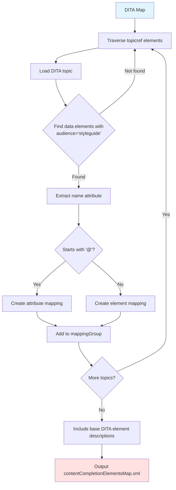
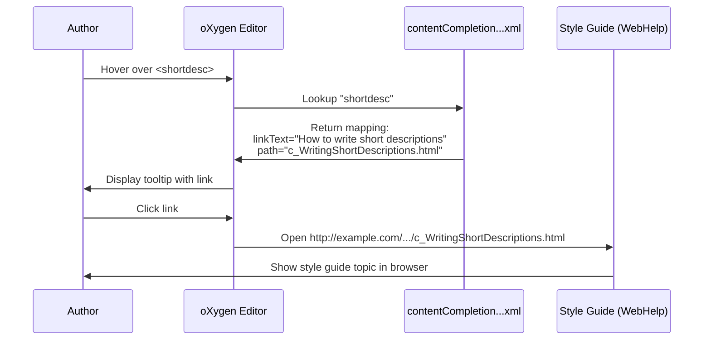

Discoverable topics are the final piece of DIM's intelligent style guide system. By annotating topics with meta-information, authors can surface style guide content **contextually** while editing DITA documents—exactly when they need it.

## The Discovery Problem

Traditional style guides have a discoverability problem:

<CardGroup cols={2}>
  <Card title="Push Model" icon="bullhorn" color="#ef4444">
    **Validation Errors**
    
    "You violated rule #47"
    
    ❌ Reactive (after the mistake)
    
    ❌ Can be ignored
  </Card>
  <Card title="Pull Model" icon="book-open" color="#3b82f6">
    **Documentation Search**
    
    "Let me look up how to use this..."
    
    ❌ Requires context switching
    
    ❌ Authors may not know what to search for
  </Card>
</CardGroup>

DIM introduces a third model:

<Card title="Contextual Model" icon="lightbulb" color="#10b981">
  **Just-in-Time Guidance**
  
  Hover over an element → See link to its style guide topic
  
  ✅ Proactive (before mistakes happen)
  
  ✅ Zero-friction access
  
  ✅ Appears in natural workflow
</Card>

## Meta-Information Annotations

Topics are made discoverable by adding `<data>` elements in the prolog metadata:

```xml
<concept id="ShortDescriptions">
  <title>Writing Short Descriptions</title>
  <prolog>
    <metadata>
      <data name="shortdesc" 
            value="How to write short descriptions" 
            audience="styleguide"/>
    </metadata>
  </prolog>
  <conbody>
    <p>The short description should be concise...</p>
  </conbody>
</concept>
```

<Info>
The `audience="styleguide"` attribute identifies metadata intended for discoverability. The `name` attribute specifies the element or attribute name, and `value` provides the link text.
</Info>

## Annotation Format

### Element Annotations

To annotate an element, use its local name:

```xml
<data name="shortdesc" 
      value="How to write short descriptions" 
      audience="styleguide"/>
```

This creates a mapping: when an author hovers over a `<shortdesc>` element in oXygen, they see a tooltip with a link labeled "How to write short descriptions" pointing to this topic.

### Attribute Annotations

To annotate an attribute, prefix the name with `@`:

```xml
<data name="@conref" 
      value="Guidelines for content references" 
      audience="styleguide"/>
```

When hovering over the `conref` attribute on any element, authors see a link to this topic.

<Tip>
Attribute annotations work across all element types, so a single annotation for `@conref` covers `<p conref="...">`, `<li conref="...">`, etc.
</Tip>

## Processing Meta-Information

The `gen-mappings.xsl` transformation extracts annotations from topics:



### Transformation Logic

The XSLT template that generates mappings:

```xml
<xsl:template match="data[@audience='styleguide']" mode="mapping"> 
  <xsl:variable name="origin" select="substring-after(base-uri(.), $base)"/>
  <xsl:variable name="target" select="replace($origin, '.dita', '.html')"/>
  
  <xsl:choose>
    <xsl:when test="starts-with(@name, '@')">
      <mapping attributeName="{substring-after(@name, '@')}" 
               path="{$target}" 
               type="link" 
               linkText="{@value}"/>
    </xsl:when>
    <xsl:otherwise>
      <mapping elementName="{@name}" 
               path="{$target}" 
               type="link" 
               linkText="{@value}"/>
    </xsl:otherwise>
  </xsl:choose>
</xsl:template>
```

This generates a `<mapping>` element for each annotation.

## Generated Configuration

The `contentCompletionElementsMap.xml` file has this structure:

```xml
<?xml version="1.0" encoding="UTF-8"?>
<contentCompletionElementsMap 
    redirectURLPrefix="http://www.oxygenxml.com/redirect-url.php?url="
    htmlContentFilterStylesheet="contentFilter.xsl">
  
  <!-- Style guide mappings -->
  <mappingGroup xml:base="http://example.com/styleguide/webhelp/">
    <mapping elementName="shortdesc"
             path="c_WritingShortDescriptions.html"
             type="link"
             linkText="How to write short descriptions"/>
    
    <mapping attributeName="conref"
             path="c_ContentReferences.html"
             type="link"
             linkText="Guidelines for content references"/>
    
    <!-- More custom mappings... -->
  </mappingGroup>
  
  <!-- Base DITA element descriptions -->
  <mappingGroup xmlns="http://www.oxygenxml.com/ns/ccfilter/annotations"
                xml:base="descriptions/">
    <mapping elementName="abbreviated-form"
             path="abbreviated-form.html"
             type="content"/>
    <mapping elementName="abstract"
             path="abstract.html"
             type="content"/>
    <!-- ... all DITA 1.3 elements ... -->
  </mappingGroup>
</contentCompletionElementsMap>
```

<Note>
The configuration includes two mapping groups: custom style guide mappings (type="link") and standard DITA element descriptions (type="content"). Custom mappings take precedence.
</Note>

## Mapping Types

DIM supports two types of mappings:

<Accordion title='type="link"'>
Shows a clickable link in the tooltip. Used for custom style guide topics.

```xml
<mapping elementName="shortdesc"
         path="c_WritingShortDescriptions.html"
         type="link"
         linkText="How to write short descriptions"/>
```

Tooltip displays: **[How to write short descriptions →]** (clickable)
</Accordion>

<Accordion title='type="content"'>
Shows inline HTML content in the tooltip. Used for standard DITA element descriptions.

```xml
<mapping elementName="abstract"
         path="abstract.html"
         type="content"/>
```

Tooltip displays the full content of `abstract.html` inline.
</Accordion>

## oXygen Integration

oXygen loads this configuration through a catalog mapping:

```xml
<catalog xmlns="urn:oasis:names:tc:entity:xmlns:xml:catalog">
  <!-- Framework-specific URL -->
  <uri name="http://www.oxygenxml.com/dita/styleguide/contentCompletionElementsMap.xml" 
       uri="contentCompletionElementsMap.xml"/>
  
  <!-- Alternative for frameworks with underscores (Oxygen 17.0+) -->
  <uri name="http://www.oxygenxml.com/dita_dim/styleguide/contentCompletionElementsMap.xml" 
       uri="contentCompletionElementsMap.xml"/>
</catalog>
```

When oXygen loads a DITA document in the `dita` or `dita_dim` framework, it:
1. Constructs the URL `http://www.oxygenxml.com/{framework}/styleguide/contentCompletionElementsMap.xml`
2. Resolves it through the catalog to the actual file
3. Loads the mappings and applies them to tooltips

<Info>
The framework name is derived from the oXygen framework ID. For custom frameworks extending DITA, update the catalog URI to match your framework name.
</Info>

## Tooltip Behavior

When an author works in oXygen:

<Steps>
  <Step title="Hover over Element">
    Author hovers the mouse over an element or attribute name in the editor
  </Step>
  <Step title="Lookup Mapping">
    oXygen queries `contentCompletionElementsMap.xml` for a matching element/attribute name
  </Step>
  <Step title="Display Tooltip">
    If a mapping exists:
    - **type="link"**: Shows the `linkText` as a clickable link
    - **type="content"**: Loads and displays the HTML from `path`
  </Step>
  <Step title="Follow Link">
    Author clicks the link → Browser opens to the published style guide topic
  </Step>
</Steps>

### Example Workflow



## Content Filtering

The `htmlContentFilterStylesheet` attribute points to an XSLT that filters HTML content:

```xml
<contentCompletionElementsMap 
    redirectURLPrefix="http://www.oxygenxml.com/redirect-url.php?url="
    htmlContentFilterStylesheet="contentFilter.xsl">
```

The `contentFilter.xsl` stylesheet:
- Removes scripts and styles
- Extracts only the body content
- Sanitizes HTML for safe display in tooltips

<Tip>
If you publish to a format other than WebHelp, create a custom `contentFilter.xsl` that extracts the relevant content from your HTML structure.
</Tip>

## URL Redirection

The `redirectURLPrefix` enables link tracking:

```xml
redirectURLPrefix="http://www.oxygenxml.com/redirect-url.php?url="
```

When authors click a tooltip link, the URL is constructed as:
```
http://www.oxygenxml.com/redirect-url.php?url=http://example.com/styleguide/webhelp/c_WritingShortDescriptions.html
```

This allows:
- Analytics on which style guide topics are accessed
- Dynamic URL resolution (e.g., version-specific redirects)
- Fallback to alternative locations if the primary is unavailable

<Note>
For internal deployments, you can remove the `redirectURLPrefix` to link directly to your style guide, or set up your own redirect service for tracking.
</Note>

## Base URL Configuration

The `xml:base` attribute on `<mappingGroup>` provides the base URL for relative paths:

```xml
<mappingGroup xml:base="http://example.com/styleguide/webhelp/">
  <mapping elementName="shortdesc"
           path="c_WritingShortDescriptions.html"
           type="link"
           linkText="How to write short descriptions"/>
</mappingGroup>
```

The full URL becomes:
```
http://example.com/styleguide/webhelp/c_WritingShortDescriptions.html
```

<Warning>
Update the `xml:base` value to match your published WebHelp location. This is critical for links to work correctly!
</Warning>

## Multiple Mappings per Topic

A single topic can be annotated for multiple elements:

```xml
<prolog>
  <metadata>
    <!-- Map to primary element -->
    <data name="task" 
          value="Guidelines for writing tasks" 
          audience="styleguide"/>
    
    <!-- Map to related elements -->
    <data name="taskbody" 
          value="Guidelines for writing tasks" 
          audience="styleguide"/>
    
    <data name="steps" 
          value="Guidelines for writing tasks" 
          audience="styleguide"/>
  </metadata>
</prolog>
```

All three elements link to the same topic, ensuring comprehensive discoverability.

## Fallback Behavior

If no custom mapping exists for an element:

1. oXygen checks the base DITA descriptions (second `<mappingGroup>`)
2. If found, displays the standard DITA element description
3. If not found, shows generic element information from the DTD/schema

This ensures authors always get **some** help, even for elements not covered by the style guide.

## Specialization Support

Since mappings use element names (not `@class` values), specialized elements require separate annotations:

```xml
<prolog>
  <metadata>
    <!-- Base element -->
    <data name="ph" 
          value="Inline element guidelines" 
          audience="styleguide"/>
    
    <!-- Specialized element -->
    <data name="uicontrol" 
          value="User interface element guidelines" 
          audience="styleguide"/>
  </metadata>
</prolog>
```

This allows different style guide topics for base and specialized elements.

<Tip>
For specialized elements that follow the same rules as their base, create a single annotation using the base element name. DITA specialization ensures the base rules apply.
</Tip>

## Framework Customization

The DIM framework includes custom actions for adding annotations:

**Add Element Annotation**
- Inserts a `<data>` template in the prolog metadata
- Pre-fills the `audience="styleguide"` attribute
- Prompts for element name and link text

**Add Attribute Annotation**
- Similar to element annotation
- Pre-fills `name` with `@` prefix
- Ensures proper attribute annotation format

These actions are available in the DIM-specific toolbar when editing DITA topics.

<Info>
The framework actions use oXygen's Author Mode API to insert XML fragments at the correct location, ensuring valid DITA structure.
</Info>

## Best Practices

<AccordionGroup>
  <Accordion title="Annotate High-Frequency Elements">
    Focus on elements authors use most often (e.g., `shortdesc`, `note`, `fig`, `table`). These provide the most value.
  </Accordion>
  
  <Accordion title="Write Clear Link Text">
    The `value` attribute should clearly describe what the topic covers:
    
    ✅ "How to write short descriptions"
    
    ❌ "Short descriptions"
  </Accordion>
  
  <Accordion title="One Mapping Per Element">
    Avoid multiple topics annotated for the same element. If you have multiple guidelines, consolidate them into one comprehensive topic.
  </Accordion>
  
  <Accordion title="Test Tooltips in oXygen">
    After generating the configuration, open a test DITA document and verify tooltips appear correctly. Check both element and attribute annotations.
  </Accordion>
</AccordionGroup>

## Comparison with Validation

Discoverable topics complement (but don't replace) validation:

| Aspect | Validation (rules.sch) | Discoverability (mappings) |
|--------|------------------------|----------------------------|
| **When** | After content is entered | While considering what to enter |
| **Type** | Reactive | Proactive |
| **Focus** | "You did this wrong" | "Here's how to do it right" |
| **Audience** | Authors who made mistakes | All authors, anytime |
| **Coverage** | Specific violations | General guidance |

Together, they provide a complete learning experience: discover best practices proactively, get notified of violations reactively.

## Integration with WebHelp

Since annotations link to published HTML, your WebHelp transformation affects the user experience:

- **Search**: Ensure the WebHelp includes search so authors can find related topics
- **Navigation**: Provide clear breadcrumbs and TOC for context
- **Cross-references**: Link related topics together
- **Examples**: Include plenty of code examples for copy-paste workflows

<Tip>
Consider enabling WebHelp Responsive with Feedback to allow authors to comment on style guide topics directly, improving the documentation over time.
</Tip>

## Deployment Scenarios

### Local Deployment

For teams working with local copies:

```xml
<mappingGroup xml:base="file:///C:/projects/styleguide/webhelp/">
  <!-- ... -->
</mappingGroup>
```

All authors must have the WebHelp at the same absolute path.

### Network Deployment

For centralized style guides:

```xml
<mappingGroup xml:base="http://intranet.company.com/styleguide/">
  <!-- ... -->
</mappingGroup>
```

Authors access the style guide over the network, ensuring everyone sees the latest version.

### Hybrid Deployment

Use catalog rewrite rules to allow both local and remote access:

```xml
<rewriteURI uriStartString="http://example.com/styleguide/webhelp/" 
            rewritePrefix="file:///C:/styleguide/webhelp/"/>
```

This rewrites remote URLs to local paths, enabling offline access.

## Next Steps

<CardGroup cols={2}>
  <Card title="Adding Annotations" href="/guides/annotating-topics" icon="plus">
    Step-by-step guide to annotating topics
  </Card>
  <Card title="oXygen Setup" href="/guides/oxygen-integration" icon="wrench">
    Configure tooltip integration
  </Card>
  <Card title="Publishing WebHelp" href="/guides/generating-deliverables" icon="globe">
    Generate and deploy the style guide
  </Card>
  <Card title="Architecture Overview" href="/concepts/overview" icon="sitemap">
    Review the complete system architecture
  </Card>
</CardGroup>
