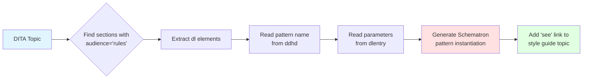

The core innovation of DIM is its **intelligent style guide**: documentation that doesn't just describe rules, but actively enforces them. This is achieved by embedding rule definitions directly within DITA topics using standard markup.

## The Problem with Traditional Style Guides

Traditional style guides suffer from a fundamental disconnect:

<CardGroup cols={2}>
  <Card title="Documentation" icon="book" color="#3b82f6">
    Explains what authors should do
    - Written in prose
    - Easy to read
    - Often becomes outdated
  </Card>
  <Card title="Validation Rules" icon="gears" color="#ef4444">
    Enforces what authors must do
    - Written in code
    - Hard to maintain
    - Disconnected from docs
  </Card>
</CardGroup>

When these exist separately, they inevitably drift out of sync. Updates to the style guide don't automatically update validation rules, and vice versa.

## DIM's Solution: Embedded Rules

DIM solves this by embedding rule instantiations directly in style guide topics. Authors read the prose explanation, while automated tools extract the embedded rules for validation.

### Basic Structure

Rules are embedded in a special section marked with `audience="rules"`:

```xml
<concept id="ShortDescriptions">
  <title>Writing Short Descriptions</title>
  <prolog>
    <metadata>
      <data name="shortdesc" value="How to write short descriptions" 
            audience="styleguide"/>
    </metadata>
  </prolog>
  <conbody>
    <p>The short description should be concise and to the point...</p>
    
    <!-- Human-readable guidelines -->
    <ul>
      <li>Limit the description to no more than 50 words</li>
      <li>Do not simply restate the title</li>
      <li>Do not conref short descriptions</li>
    </ul>
    
    <!-- Machine-readable rules -->
    <section audience="rules">
      <title>Business Rules</title>
      <p>We will check to have no more than 50 words:</p>
      <dl>
        <dlhead>
          <dthd>Rule</dthd>
          <ddhd>restrictWords</ddhd>
        </dlhead>
        <dlentry>
          <dt>parentElement</dt>
          <dd>shortdesc</dd>
        </dlentry>
        <dlentry>
          <dt>minWords</dt>
          <dd>1</dd>
        </dlentry>
        <dlentry>
          <dt>maxWords</dt>
          <dd>50</dd>
        </dlentry>
        <dlentry>
          <dt>message</dt>
          <dd>Keep short descriptions between 1 and 50 words!</dd>
        </dlentry>
      </dl>
    </section>
  </conbody>
</concept>
```

<Info>
The `audience="rules"` attribute identifies sections that contain rule definitions. These sections are processed by `gen-rules.xsl` to generate Schematron validation.
</Info>

## Rule Definition Format

Rules use DITA definition lists (`dl`) with a specific structure:

<Steps>
  <Step title="Definition List Header">
    The `dlhead` identifies the rule pattern from the library:
    - `dthd`: Always contains the text "Rule"
    - `ddhd`: Contains the pattern name (e.g., `restrictWords`, `avoidWordInElement`)
  </Step>
  <Step title="Parameter Entries">
    Each `dlentry` specifies one parameter:
    - `dt`: Parameter name
    - `dd`: Parameter value
  </Step>
</Steps>

### Real-World Examples

<Accordion title="Example 1: Avoid Duplicate Content">
This rule checks that short descriptions don't simply repeat the title:

```xml
<dl>
  <dlhead>
    <dthd>Rule</dthd>
    <ddhd>avoidDuplicateContent</ddhd>
  </dlhead>
  <dlentry>
    <dt>matchElement</dt>
    <dd>shortdesc</dd>
  </dlentry>
  <dlentry>
    <dt>targetElement</dt>
    <dd>title</dd>
  </dlentry>
  <dlentry>
    <dt>message</dt>
    <dd>Do not just restate the title in the short description.</dd>
  </dlentry>
</dl>
```

This instantiates the `avoidDuplicateContent` abstract pattern from `library.sch`, comparing the content of `shortdesc` elements with their sibling `title` elements.
</Accordion>

<Accordion title="Example 2: Avoid Attributes">
This rule prevents the use of `conref` attributes on short descriptions:

```xml
<dl>
  <dlhead>
    <dthd>Rule</dthd>
    <ddhd>avoidAttributeInElement</ddhd>
  </dlhead>
  <dlentry>
    <dt>element</dt>
    <dd>shortdesc</dd>
  </dlentry>
  <dlentry>
    <dt>attribute</dt>
    <dd>conref</dd>
  </dlentry>
  <dlentry>
    <dt>message</dt>
    <dd>Short descriptions content should not be referred through content references.</dd>
  </dlentry>
</dl>
```

This prevents content reuse patterns that would make short descriptions less contextual.
</Accordion>

<Accordion title="Example 3: Require Content After Element">
This rule ensures topics contain more than just a short description:

```xml
<dl>
  <dlhead>
    <dthd>Rule</dthd>
    <ddhd>requireContentAfterElement</ddhd>
  </dlhead>
  <dlentry>
    <dt>element</dt>
    <dd>shortdesc</dd>
  </dlentry>
  <dlentry>
    <dt>message</dt>
    <dd>Avoid topics that contain nothing but a short description.</dd>
  </dlentry>
</dl>
```

This enforces the guideline that topics should provide substantial content beyond the short description.
</Accordion>

## How Rules Are Processed

The `gen-rules.xsl` transformation script extracts rules from the style guide:



### Generated Schematron

For the `restrictWords` example above, the generated Schematron looks like:

```xml
<!--Generated from info-model/c_WritingShortDescriptions.dita.-->
<pattern is-a="restrictWords" 
         see="http://example.com/styleguide/webhelp/c_WritingShortDescriptions.html">
  <param name="parentElement" value="shortdesc"/>
  <param name="minWords" value="1"/>
  <param name="maxWords" value="50"/>
  <param name="message" value="Keep short descriptions between 1 and 50 words!"/>
</pattern>
```

<Note>
The `see` attribute creates a clickable link in oXygen's validation results, connecting error messages directly to the style guide topic that explains the rule's rationale.
</Note>

## Benefits of Embedded Rules

### Single Source of Truth

Rules are defined exactly once, in the same location as the prose explanation. There's no separate validation file to keep in sync.

```xml
<!-- In the style guide topic -->
<p>Limit the description to no more than 50 words</p>

<!-- Rule definition immediately follows -->
<dl>
  <dlhead>
    <dthd>Rule</dthd>
    <ddhd>restrictWords</ddhd>
  </dlhead>
  <!-- ... parameters including maxWords=50 ... -->
</dl>
```

### Contextual Documentation

When validation fails, the `see` link takes authors to the **exact topic** that explains why the rule exists, including:
- The rationale behind the guideline
- Examples of good and bad practice
- Contextual information about when exceptions might apply

### Declarative Syntax

Authors don't need to learn Schematron or XSLT. They simply:
1. Choose an appropriate pattern from the library
2. Fill in parameter values using a simple list format
3. Write a clear error message for authors

<Tip>
The oXygen DIM framework includes custom actions that insert rule templates, making it even easier to add new rules without memorizing the syntax.
</Tip>

## Multiple Rules per Topic

A single topic can define multiple rules. For example, the short description topic includes:

<Steps>
  <Step title="Word count limit">
    Instantiates `restrictWords` to enforce 1-50 words
  </Step>
  <Step title="Avoid duplicating title">
    Instantiates `avoidDuplicateContent` to compare with title
  </Step>
  <Step title="No conref attributes">
    Instantiates `avoidAttributeInElement` twice (for `conref` and `conkeyref`)
  </Step>
  <Step title="Require additional content">
    Instantiates `requireContentAfterElement` to prevent stub topics
  </Step>
</Steps>

All five rules are extracted from a single topic, ensuring authors see all related guidelines in one place.

## Audience Filtering

The `audience="rules"` attribute serves multiple purposes:

**During Authoring**
- oXygen can filter the view to hide/show rule sections
- Authors can focus on either prose or rules as needed

**During Publishing**
- Rule sections can be excluded from end-user documentation
- Style guides for different audiences can be generated from the same source

**During Processing**
- `gen-rules.xsl` selects only sections with `audience="rules"`
- Other sections are ignored, allowing free-form content

<CodeGroup>
```xml Visible to All
<p>The short description should be concise...</p>
```

```xml Visible Only in Author View
<section audience="rules">
  <title>Business Rules</title>
  <dl>...</dl>
</section>
```
</CodeGroup>

## Best Practices

<AccordionGroup>
  <Accordion title="Co-locate Rules with Guidelines">
    Place rule sections immediately after the prose that describes them. This makes it obvious which rules enforce which guidelines.
  </Accordion>
  
  <Accordion title="Write Clear Messages">
    The `message` parameter should explain what's wrong and how to fix it. Avoid technical jargon.
    
    Good: "Keep short descriptions between 1 and 50 words!"
    
    Bad: "restrictWords validation failed"
  </Accordion>
  
  <Accordion title="Document Rule Rationale">
    In the prose section, explain **why** the rule exists, not just what it checks. This helps authors understand the purpose when they encounter validation errors.
  </Accordion>
  
  <Accordion title="Use Consistent Terminology">
    Use the same element names in prose and rule parameters. If the prose says "short description," the rule should reference `shortdesc` with a clear connection.
  </Accordion>
</AccordionGroup>

## Integration with DITA Publishing

Rule sections are standard DITA content, so they work with any DITA publishing toolchain:

- **WebHelp**: Rules can be included or excluded based on audience filtering
- **PDF**: Rules can be styled differently (e.g., in a colored box)
- **HTML5**: Rules can be collapsed in an accordion for compact display

<Warning>
When publishing style guides for end users (not just authors), consider excluding the `audience="rules"` sections to avoid exposing technical implementation details.
</Warning>

## Next Steps

<CardGroup cols={2}>
  <Card title="Rule Enforcement" href="/concepts/rule-enforcement" icon="shield-check">
    Understand how abstract patterns are instantiated
  </Card>
  <Card title="Library Patterns" href="/api/library-patterns" icon="book-open">
    Browse available validation patterns
  </Card>
  <Card title="Adding Rules" href="/guides/defining-rules" icon="plus">
    Learn to add rules to your style guide
  </Card>
  <Card title="Custom Patterns" href="/advanced/custom-rules" icon="code">
    Create your own abstract patterns
  </Card>
</CardGroup>
