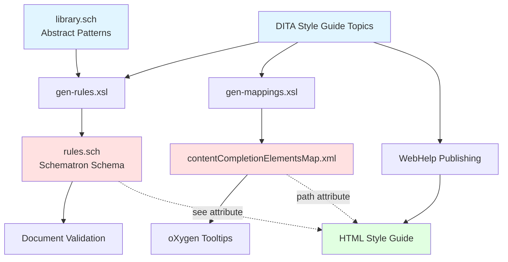
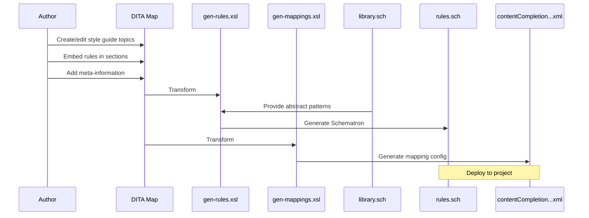

The Dynamic Information Model (DIM) represents a paradigm shift in how style guides are created and enforced. Rather than maintaining separate documentation and validation rules, DIM unifies these concerns into a single DITA-based system that is both human-readable and machine-enforceable.

## Core Architecture

DIM consists of four interconnected components that work together to create an intelligent documentation ecosystem:

<CardGroup cols={2}>
  <Card title="DITA Style Guide" icon="book">
    Human-readable guidelines written in standard DITA markup
  </Card>
  <Card title="Rule Library" icon="code">
    Abstract Schematron patterns for validation logic
  </Card>
  <Card title="XSLT Processors" icon="gears">
    Transformation scripts that generate artifacts
  </Card>
  <Card title="oXygen Integration" icon="plug">
    Editor framework with custom actions and tooltips
  </Card>
</CardGroup>

## How Components Interact

The following diagram illustrates the data flow between DIM's core components:



### Component Responsibilities

**Style Guide Topics** (`info-model/*.dita`)
- Contain human-readable authoring guidelines
- Embed rule instantiations in sections marked with `audience="rules"`
- Include meta-information annotations via `data` elements with `audience="styleguide"`

**Rule Library** (`info-model/rules/library.sch`)
- Defines abstract Schematron patterns with parameters
- Provides reusable validation logic (e.g., `avoidWordInElement`, `restrictWords`)
- Documents each pattern's purpose and parameters

**XSLT Processors**
- `gen-rules.xsl`: Extracts embedded rules and instantiates abstract patterns
- `gen-mappings.xsl`: Extracts meta-information to create element/attribute mappings
- `dim2sch.xsl`: Framework-level processor for integrated transformations

**Generated Artifacts**
- `rules.sch`: Concrete Schematron schema for document validation
- `contentCompletionElementsMap.xml`: Configuration for editor tooltips
- `webhelp/`: Published HTML documentation

## Information Flow

<Steps>
  <Step title="Authoring">
    Technical writers create style guide topics in DITA, embedding rule definitions directly in the prose
  </Step>
  <Step title="Generation">
    XSLT processors extract rules and mappings from the DITA source
  </Step>
  <Step title="Validation">
    The generated Schematron schema validates documents against style guide rules
  </Step>
  <Step title="Discovery">
    oXygen shows contextual links to style guide topics when editing elements
  </Step>
</Steps>

## Key Design Principles

<Accordion title="Single Source of Truth">
Rules are defined once in the style guide topic, not duplicated in separate validation files. This eliminates synchronization issues between documentation and enforcement.
</Accordion>

<Accordion title="Bi-directional Linking">
Validation errors link back to the style guide topic where the rule was defined (via Schematron `see` attribute). Element tooltips link forward to topics describing usage guidelines.
</Accordion>

<Accordion title="Declarative Rule Instantiation">
Authors don't write complex validation logic. Instead, they instantiate pre-built patterns from the library by specifying parameter values in a simple definition list format.
</Accordion>

<Accordion title="Framework Extensibility">
The oXygen framework provides custom actions for adding rules and meta-information, lowering the barrier to adoption.
</Accordion>

## Processing Pipeline

The DIM processing pipeline transforms source content into deployable artifacts:



## File Organization

DIM follows a structured directory layout:

<CodeGroup>
```plaintext Directory Structure
info-model/
├── styleguide.ditamap          # Main DITA map
├── c_*.dita                    # Style guide topics
└── rules/
    ├── library.sch             # Abstract patterns
    ├── rules.sch               # Generated schema
    ├── contentCompletion...xml # Generated mappings
    ├── catalog.xml             # URI resolution
    └── styleguide/webhelp/     # Published output

gen-rules/
├── gen-rules.xsl               # Rule extraction
├── gen-mappings.xsl            # Mapping extraction
└── dim2sch.xsl                 # Framework processor

frameworks/dim/
└── [oXygen framework files]
```
</CodeGroup>

<Info>
The `catalog.xml` file provides URI resolution using OASIS XML Catalogs, enabling the use of logical URIs like `urn:rules:library.sch` instead of absolute file paths.
</Info>

## Validation Workflow

When an author edits a DITA document in oXygen:

1. **Document opened**: oXygen loads the framework configuration
2. **Auto-complete triggered**: The `contentCompletionElementsMap.xml` provides element descriptions
3. **Tooltip displayed**: Shows link to relevant style guide topic (if annotated)
4. **Validation executed**: The `rules.sch` schema validates the document
5. **Error shown**: Validation message includes `see` link to the style guide topic explaining the rule

<Tip>
The `see` attribute in Schematron patterns creates clickable links in oXygen's validation results, taking authors directly to the style guide section that explains why the rule exists.
</Tip>

## Extension Points

DIM is designed to be customizable:

- **Add new patterns**: Extend `library.sch` with additional abstract patterns
- **Custom actions**: Add framework actions for common authoring tasks
- **Alternative outputs**: Replace WebHelp with other publishing formats
- **Different editors**: Adapt the mapping format for other XML editors

## Next Steps

<CardGroup cols={2}>
  <Card title="Intelligent Style Guide" href="/concepts/intelligent-styleguide" icon="brain">
    Learn how rules are embedded in DITA topics
  </Card>
  <Card title="Rule Enforcement" href="/concepts/rule-enforcement" icon="shield-check">
    Understand the library pattern system
  </Card>
  <Card title="Discoverable Topics" href="/concepts/discoverable-topics" icon="magnifying-glass">
    Explore meta-information annotations
  </Card>
  <Card title="Quick Start" href="/quickstart" icon="rocket">
    Set up your first DIM project
  </Card>
</CardGroup>
