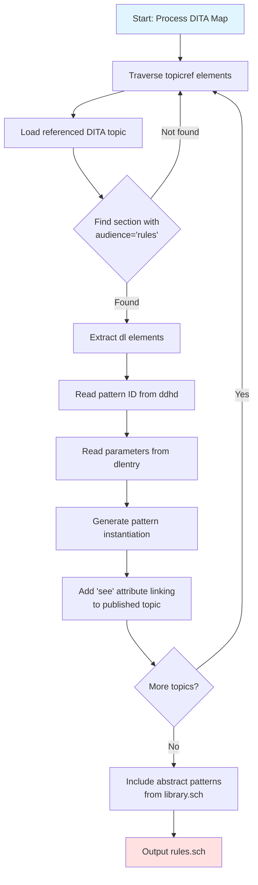

DIM's rule enforcement system is built on **abstract Schematron patterns** that act as reusable templates. Style guide authors instantiate these patterns by providing parameter values, without writing any validation logic themselves.

## Abstract Patterns as Templates

The `library.sch` file contains abstract patterns—parameterized validation rules that can be instantiated multiple times with different values:

```xml
<pattern abstract="true" id="avoidWordInElement">
  <title>Issue a warning if a word or phrase appears inside a specified element</title>
  <p>This pattern allows you to advise users not to use a specific
    word in an element, or in multiple elements, if you separate them using '|'. 
    The check is case insensitive.</p>
  <parameters xmlns="http://oxygenxml.com/ns/schematron/params">
    <parameter>
      <name>element</name>
      <desc>Specifies the element we will verify to not contain a specified word.</desc>
    </parameter>
    <parameter>
      <name>word</name>
      <desc>Specifies the word or phrase we will look for.</desc>
    </parameter>
    <parameter>
      <name>message</name>
      <desc>The message the end user will see when the specified word appears.</desc>
    </parameter>
  </parameters> 
  <rule context="$element">
    <assert test="not(matches(., '(\s|^)($word)(\s|$)', 'i'))"
            role="warn" sqf:fix="avoidWordInElement_deleteWord avoidWordInElement_replaceWord">
      $message
    </assert>
  </rule>
</pattern>
```

<Info>
The `abstract="true"` attribute indicates this pattern is a template. The `$element`, `$word`, and `$message` variables are placeholders that get replaced during instantiation.
</Info>

## Pattern Library

DIM includes a comprehensive library of abstract patterns covering common style guide requirements:

<CardGroup cols={2}>
  <Card title="Content Patterns" icon="text">
    - `avoidWordInElement`
    - `avoidEndFragment`
    - `restrictWords`
    - `restrictCharacters`
  </Card>
  <Card title="Structure Patterns" icon="sitemap">
    - `recommendElementInParent`
    - `restrictNesting`
    - `restrictNumberOfChildren`
    - `restrictChildrenElements`
  </Card>
  <Card title="Attribute Patterns" icon="tag">
    - `avoidAttributeInElement`
  </Card>
  <Card title="Relationship Patterns" icon="link">
    - `avoidDuplicateContent`
    - `requireContentAfterElement`
  </Card>
</CardGroup>

### DITA-Specific Patterns

The library also includes patterns tailored for DITA:

- `dita-allowedElementsForClass`: Restricts elements based on DITA `@class` attribute
- `dita-allowOnlyBlockElements`: Ensures elements contain only block-level content

<Tip>
Pattern names prefixed with `dita-` are specific to DITA specializations and use the `@class` attribute for element matching, making them work across DITA specialization hierarchies.
</Tip>

## Instantiation Process

When `gen-rules.xsl` processes a style guide, it follows this workflow:



### Transformation Logic

The key XSLT template that performs instantiation:

```xml
<xsl:template match="dl" mode="instantiate">
  <xsl:variable name="origin" select="substring-after(base-uri(.), $base)"/>
  <xsl:variable name="target">
    <xsl:text>http://example.com/styleguide/webhelp/</xsl:text>
    <xsl:value-of select="replace($origin, '.dita', '.html')"/>
  </xsl:variable>
  <xsl:comment>Generated from <xsl:value-of select="$origin"/>.</xsl:comment>
  <pattern is-a="{dlhead/ddhd}" see="{$target}">
    <xsl:apply-templates mode="instantiate"/>
  </pattern>
</xsl:template>

<xsl:template match="dlentry" mode="instantiate">
  <xsl:variable name="ap">'</xsl:variable>
  <xsl:variable name="doubleap">''</xsl:variable>
  <param name="{dt}" value="{replace(dd, $ap, $doubleap)}"/>
</xsl:template>
```

This transforms DITA definition lists into Schematron pattern instantiations with proper parameter bindings.

<Note>
The transformation escapes single quotes in parameter values by doubling them (`'` becomes `''`), which is necessary for valid XPath expressions in Schematron.
</Note>

## Example Transformation

### Source: DITA Style Guide

```xml
<section audience="rules">
  <title>Business Rules</title>
  <dl>
    <dlhead>
      <dthd>Rule</dthd>
      <ddhd>restrictWords</ddhd>
    </dlhead>
    <dlentry>
      <dt>parentElement</dt>
      <dd>shortdesc</dd>
    </dlentry>
    <dlentry>
      <dt>minWords</dt>
      <dd>1</dd>
    </dlentry>
    <dlentry>
      <dt>maxWords</dt>
      <dd>50</dd>
    </dlentry>
    <dlentry>
      <dt>message</dt>
      <dd>Keep short descriptions between 1 and 50 words!</dd>
    </dlentry>
  </dl>
</section>
```

### Generated: Schematron Instantiation

```xml
<!--Generated from info-model/c_WritingShortDescriptions.dita.-->
<pattern is-a="restrictWords" 
         see="http://example.com/styleguide/webhelp/c_WritingShortDescriptions.html">
  <param name="parentElement" value="shortdesc"/>
  <param name="minWords" value="1"/>
  <param name="maxWords" value="50"/>
  <param name="message" value="Keep short descriptions between 1 and 50 words!"/>
</pattern>
```

### Final: Expanded Schematron

The Schematron processor expands the instantiated pattern:

```xml
<pattern>
  <rule context="shortdesc">
    <let name="words" value="count(tokenize(normalize-space(.), ' '))"/>
    <assert test="$words &lt;= 50" role="warn">
      Keep short descriptions between 1 and 50 words!
      You have <value-of select="$words"/>
      <value-of select="if ($words=1) then ' word' else ' words'"/>. 
    </assert>
    <assert test="$words &gt;= 1" role="warn">
      Keep short descriptions between 1 and 50 words!
      You have <value-of select="$words"/>
      <value-of select="if ($words=1) then ' word' else ' words'"/>.
    </assert>
  </rule>
</pattern>
```

All `$parentElement`, `$minWords`, and `$maxWords` variables have been replaced with concrete values.

## Pattern Design Principles

### Parameterization

Well-designed patterns expose the right parameters:

<AccordionGroup>
  <Accordion title="What to Parameterize">
    - Element and attribute names (context)
    - Threshold values (min/max)
    - Custom error messages
    - Pattern-specific options (e.g., case sensitivity)
  </Accordion>
  
  <Accordion title="What NOT to Parameterize">
    - Core validation logic
    - Complex XPath expressions
    - Conditional branches (use separate patterns instead)
  </Accordion>
</AccordionGroup>

### Example: Flexible Element Selection

The `avoidWordInElement` pattern allows multiple elements:

```xml
<parameter>
  <name>element</name>
  <desc>Specifies the element we will verify to not contain a specified word. 
    You can specify multiple elements if you separate them using a pipe character, 
    for example title|p will check both title and p elements.</desc>
</parameter>
```

Instantiated as:

```xml
<dl>
  <dlhead>
    <dthd>Rule</dthd>
    <ddhd>avoidWordInElement</ddhd>
  </dlhead>
  <dlentry>
    <dt>element</dt>
    <dd>title|p|shortdesc</dd>  <!-- Multiple elements -->
  </dlentry>
  <dlentry>
    <dt>word</dt>
    <dd>utilize</dd>
  </dlentry>
  <dlentry>
    <dt>message</dt>
    <dd>Use 'use' instead of 'utilize'.</dd>
  </dlentry>
</dl>
```

This creates a rule context of `title|p|shortdesc`, matching all three elements.

## Advanced Patterns

### Nested Context with Variables

The `restrictWords` pattern demonstrates sophisticated logic:

```xml
<rule context="$parentElement">
  <let name="words" value="count(tokenize(normalize-space(.), ' '))"/>
  <assert test="$words &lt;= $maxWords" role="warn">
    $message
    You have <value-of select="$words"/>
    <value-of select="if ($words=1) then ' word' else ' words'"/>. 
  </assert>
  <assert test="$words &gt;= $minWords" role="warn">
    $message
    You have <value-of select="$words"/>
    <value-of select="if ($words=1) then ' word' else ' words'"/>.
  </assert>
</rule>
```

Key features:
- `<let>` variable calculates word count once
- Two `<assert>` elements check upper and lower bounds
- Conditional singular/plural text for grammatical correctness

### Character Count with Normalization

The `restrictCharacters` pattern includes a normalization option:

```xml
<rule context="$parentElement">
  <let name="characters" 
       value="string-length(if ($normalize = ('true', 'true()', 'yes')) 
                            then normalize-space(.) 
                            else .)"/>
  <assert test="$characters &lt;= $maxChars" role="warn">
    $message
    It is recommended to not exceed $maxChars
    <value-of select="if ($maxChars=1) then ' character' else ' characters'"/>!
    You have <value-of select="$characters"/>
    <value-of select="if ($characters=1) then ' character' else ' characters'"/>. 
  </assert>
  <!-- ... -->
</rule>
```

Instantiated with:

```xml
<dlentry>
  <dt>normalize</dt>
  <dd>yes</dd>  <!-- Whitespace normalized before counting -->
</dlentry>
```

## Schematron Quick Fixes

DIM patterns include `sqf:fix` attributes for automated corrections:

```xml
<assert test="not(matches(., '(\s|^)($word)(\s|$)', 'i'))"
        role="warn" 
        sqf:fix="avoidWordInElement_deleteWord avoidWordInElement_replaceWord">
  $message
</assert>
```

The `quickFix-library.xml` file defines these quick fixes:

```xml
<sqf:fix id="avoidWordInElement_deleteWord">
  <sqf:description>
    <sqf:title>Delete the word</sqf:title>
  </sqf:description>
  <!-- ... implementation ... -->
</sqf:fix>
```

<Info>
Schematron QuickFix (SQF) enables oXygen to offer one-click corrections for validation errors. Authors can fix issues without manually editing XML.
</Info>

## Generated Schema Structure

The final `rules.sch` file has this structure:

```xml
<?xml version="1.0" encoding="UTF-8"?>
<!--
  Do not edit this file directly!
  This file is generated automatically by processing styleguide.ditamap
  If you want to change the rules, edit the corresponding sections 
  marked with audience="rules" in the corresponding topic files.
-->
<schema xmlns="http://purl.oclc.org/dsdl/schematron" queryBinding="xslt2">
  
  <!-- Include abstract patterns from library -->
  <include href="library.sch#avoidWordInElement"/>
  <include href="library.sch#avoidEndFragment"/>
  <include href="library.sch#avoidAttributeInElement"/>
  <!-- ... all abstract patterns ... -->
  
  <!-- Include quick fix library -->
  <include href="quickFix-library.xml"/>
  
  <!-- Instantiated patterns from style guide topics -->
  <!--Generated from info-model/c_WritingShortDescriptions.dita.-->
  <pattern is-a="restrictWords" see="http://...">
    <param name="parentElement" value="shortdesc"/>
    <!-- ... -->
  </pattern>
  
  <!-- More instantiated patterns ... -->
  
</schema>
```

<Warning>
The generated `rules.sch` file includes a warning comment: **Do not edit this file directly!** Any manual changes will be lost when the schema is regenerated from the style guide source.
</Warning>

## Validation Lifecycle

When a document is validated:

<Steps>
  <Step title="Load Schema">
    oXygen loads `rules.sch` and expands all pattern instantiations
  </Step>
  <Step title="Apply Rules">
    Each pattern's rules are evaluated against the document
  </Step>
  <Step title="Collect Violations">
    Failed assertions generate validation messages
  </Step>
  <Step title="Display Results">
    Messages include the custom text from the `message` parameter and the `see` link to the style guide
  </Step>
</Steps>

## Catalog Resolution

The `catalog.xml` file enables logical URI references:

```xml
<catalog xmlns="urn:oasis:names:tc:entity:xmlns:xml:catalog">
  <!-- Map logical URIs to physical files -->
  <rewriteURI uriStartString="urn:rules:" rewritePrefix="./"/>
  
  <!-- Map published URLs to local WebHelp -->
  <rewriteURI uriStartString="http://example.com/styleguide/webhelp/" 
              rewritePrefix="styleguide/webhelp/"/>
</catalog>
```

This allows:
- `urn:rules:library.sch` → `./library.sch`
- `http://example.com/styleguide/webhelp/c_WritingShortDescriptions.html` → `styleguide/webhelp/c_WritingShortDescriptions.html`

<Tip>
Update the `rewritePrefix` value to point to your actual WebHelp location (local or remote) to ensure the `see` links work correctly in validation messages.
</Tip>

## Extending the Library

To add a new abstract pattern:

<Steps>
  <Step title="Define Pattern">
    Add a new `<pattern abstract="true">` to `library.sch`
  </Step>
  <Step title="Document Parameters">
    Use `<parameters>` with `<parameter>` elements to describe each variable
  </Step>
  <Step title="Write Validation Logic">
    Use `$parameterName` placeholders in your rules
  </Step>
  <Step title="Regenerate Schema">
    Run `gen-rules.xsl` to include the new pattern in `rules.sch`
  </Step>
  <Step title="Instantiate in Topics">
    Style guide authors can now use your pattern by referencing its `id`
  </Step>
</Steps>

Example new pattern:

```xml
<pattern abstract="true" id="requireAttributeValue">
  <title>Require a specific attribute value</title>
  <parameters xmlns="http://oxygenxml.com/ns/schematron/params">
    <parameter>
      <name>element</name>
      <desc>The element to check</desc>
    </parameter>
    <parameter>
      <name>attribute</name>
      <desc>The required attribute</desc>
    </parameter>
    <parameter>
      <name>value</name>
      <desc>The required value</desc>
    </parameter>
    <parameter>
      <name>message</name>
      <desc>Error message</desc>
    </parameter>
  </parameters>
  <rule context="$element">
    <assert test="@$attribute = '$value'" role="error">
      $message
    </assert>
  </rule>
</pattern>
```

## Next Steps

<CardGroup cols={2}>
  <Card title="Library Patterns" href="/api/library-patterns" icon="book-open">
    Complete reference of available patterns
  </Card>
  <Card title="Custom Patterns" href="/advanced/custom-rules" icon="code">
    Create your own validation patterns
  </Card>
  <Card title="Discoverable Topics" href="/concepts/discoverable-topics" icon="magnifying-glass">
    Learn about meta-information annotations
  </Card>
  <Card title="oXygen Setup" href="/guides/oxygen-integration" icon="wrench">
    Configure validation in your editor
  </Card>
</CardGroup>
