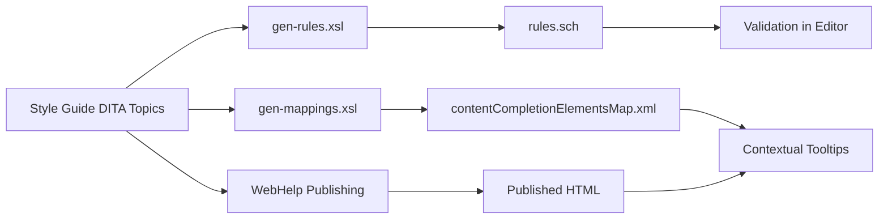

## What is DIM?

The **Dynamic Information Model (DIM)** is an intelligent style guide framework that transforms traditional style guides into enforceable, auto-discoverable documentation systems. Unlike conventional style guides that simply describe rules, DIM actively validates and enforces those rules in your DITA content.

<Note>
DIM bridges the gap between documentation and validation by embedding enforceable rules directly within your style guide topics using native DITA markup.
</Note>

## Why DIM Exists

Traditional style guides face several challenges:

- **Passive Documentation**: Style guides typically describe rules but can't enforce them
- **Discoverability Issues**: Authors must manually search for relevant guidelines
- **Maintenance Overhead**: Keeping rules synchronized with validation schemas requires duplicate effort
- **Context Gap**: Rules exist separately from the elements and attributes they govern

DIM solves these problems by creating a unified system where:

1. Style guide prose and validation rules coexist in the same topics
2. Authors receive contextual guidance through tool tips and automated validation
3. Rules are automatically generated from style guide content
4. Topics are discoverable based on the elements and attributes they describe

## Key Capabilities

### 1. Embedded Validation Rules

DIM allows you to embed Schematron-based validation rules directly within DITA topics using standard markup:

```xml
<section audience="rules">
  <title>Business Rules</title>
  <dl>
    <dlhead>
      <dthd>Rule</dthd>
      <ddhd>restrictWords</ddhd>
    </dlhead>
    <dlentry>
      <dt>parentElement</dt>
      <dd>title</dd>
    </dlentry>
    <dlentry>
      <dt>minWords</dt>
      <dd>1</dd>
    </dlentry>
    <dlentry>
      <dt>maxWords</dt>
      <dd>8</dd>
    </dlentry>
    <dlentry>
      <dt>message</dt>
      <dd>Keep titles concise!</dd>
    </dlentry>
  </dl>
</section>
```

This rule instantiates the abstract `restrictWords` pattern from DIM's rule library to limit title length to 8 words.

### 2. Auto-Discoverable Topics

Topics can be annotated with metadata that maps them to specific DITA elements or attributes, making them discoverable from within your authoring tool:

```xml
<data audience="styleguide" name="title" value="Titling Topics"/>
<data audience="styleguide" name="@conref" value="Using conref"/>
```

### 3. Automated Generation

DIM provides XSLT scripts that automatically generate:

- **Schematron validation schema** (`rules.sch`) containing all embedded rules with links back to source topics
- **Content completion mappings** (`contentCompletionElementsMap.xml`) for element/attribute tooltips
- **Published style guide** in WebHelp or other formats

### 4. Generic Rule Library

DIM includes a comprehensive library of reusable Schematron abstract patterns:

| Rule Pattern | Purpose |
|--------------|---------|
| `avoidWordInElement` | Prevent specific words in elements |
| `restrictWords` | Enforce word count limits |
| `restrictCharacters` | Enforce character count limits |
| `recommendElementInParent` | Suggest optional child elements |
| `avoidAttributeInElement` | Warn against certain attributes |
| `restrictNesting` | Control nesting depth |
| `restrictChildrenElements` | Limit allowed child elements |

<Tip>
All patterns are defined as abstract Schematron patterns, allowing you to instantiate them with specific parameters for your use cases.
</Tip>

## Architecture Overview

DIM consists of four main components:

<Steps>

<Step title="Style Guide Topics">
DITA topics containing both human-readable prose and machine-readable rules embedded in `<section audience="rules">` elements. Topics include metadata annotations for discoverability.
</Step>

<Step title="Rule Library">
A Schematron file (`info-model/rules/library.sch`) containing generic abstract patterns that can be instantiated with specific parameters.
</Step>

<Step title="Generation Scripts">
XSLT transformations that process the style guide to generate:
- `gen-rules/gen-rules.xsl` - Generates the Schematron validation schema
- `gen-rules/gen-mappings.xsl` - Generates content completion mappings
</Step>

<Step title="Framework Extensions">
oXygen XML Editor framework that provides DIM-specific actions for adding rules and metadata to topics, plus integration with generated artifacts.
</Step>

</Steps>

### Processing Flow



## Use Cases

<CardGroup cols={2}>

<Card title="Enterprise Style Guides" icon="building">
Enforce company-wide content standards across distributed authoring teams with automated validation
</Card>

<Card title="Compliance Documentation" icon="shield-check">
Ensure regulatory requirements are embedded and enforced at authoring time rather than review time
</Card>

<Card title="Content Quality Control" icon="check-circle">
Maintain consistency in terminology, structure, and formatting across large documentation sets
</Card>

<Card title="Author Training" icon="graduation-cap">
Provide contextual, just-in-time guidance to authors through integrated tooltips and validation messages
</Card>

</CardGroup>

## Technology Stack

- **DITA**: Darwin Information Typing Architecture for structured authoring
- **Schematron**: ISO standard for rule-based XML validation using abstract patterns
- **XSLT 2.0**: Transformation language for generating validation and mapping files
- **oXygen XML Editor**: Recommended authoring environment with full DIM integration

<Warning>
DIM is specifically designed for DITA-based documentation workflows. If you're not using DITA, you'll need to adapt the concepts to your markup format.
</Warning>

## Who Should Use DIM?

DIM is ideal for:

- **Documentation teams** managing large-scale DITA content
- **Information architects** designing content models and style guides
- **Technical writers** who need immediate feedback on style compliance
- **Content strategists** implementing structured authoring best practices

## Next Steps

<CardGroup cols={2}>

<Card title="Quick Start" icon="rocket" href="/quickstart">
Get DIM up and running in minutes with our step-by-step guide
</Card>

<Card title="Installation" icon="download" href="/installation">
Detailed installation instructions and prerequisites
</Card>

</CardGroup>

## License

DIM is licensed under the [Apache License 2.0](http://www.apache.org/licenses/LICENSE-2.0), allowing you to use it freely in both commercial and open source projects.

**Copyright © 2015, Syncro Soft SRL**
